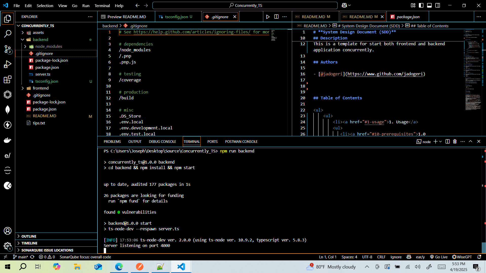
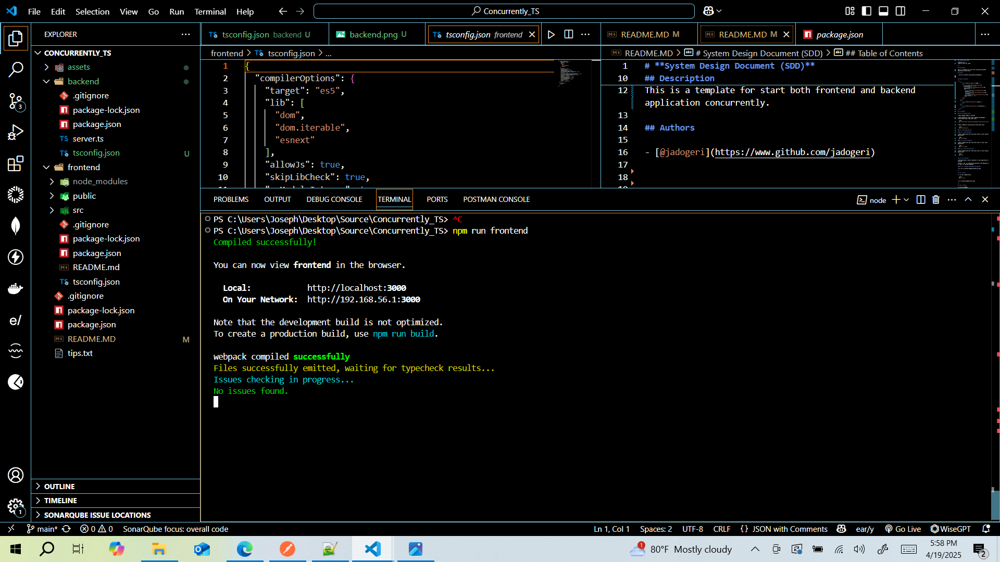
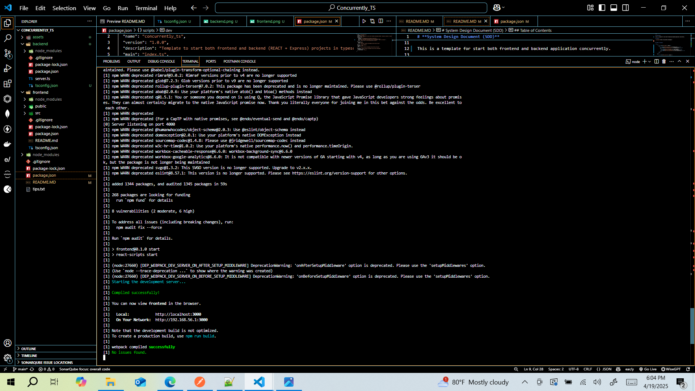

# **System Design Document (SDD)**

## **Concurrently TS**

**Version:** 1.1
**Date:** April 15, 2025

---

## Description

This is a template for start both frontend and backend application concurrently.

## Authors

- [@jadogeri](https://www.github.com/jadogeri)


## Table of Contents

<ul>
    <ul>
        <li><a href="#1-usage">1. Usage</a>
        <ul>
           <li><a href="#10-prerequisites">1.0 Prerequisites</a> </li>
            <li><a href="#11-run-application">1.1 Run Application</a> </li>
            <ul>
              <li><a href="#111-run-backend">1.1.1 Run Backend</a> </li>
              <li><a href="#112-run-frontend">1.1.2 Run Frontend</a> </li>
             <li><a href="#111-run-concurrently">1.1.3 Run Concurrently</a> </li>
            </ul>
        </ul>
        </li>
    </ul> 
    <ul>  
        <li><a href="#9-license">2. License</a>
        </li>
    </ul> 
    <ul> 
        <li><a href="#10-references">3. References</a>
        </li>
    <ul>
</ul>

## **1 Usage**

### **1.0 Prerequisites**

1 Open command prompt or terminal.

2 Type command git clone https://github.com/jadogeri/Concurrently_TS.git then press enter.

```bash
  git clone https://github.com/jadogeri/Concurrently_TS.git
```

3 Enter command cd Concurrently_TS then press enter.

```bash
  cd Concurrently_TS
```
### **1.1 Run Application**

#### **1.1.1 Run Backend**

1 Enter command npm run backend then press enter to start express application.

```bash
  npm run backend
```



#### **1.1.2 Run Frontend**

1 Enter command npm run frontend then press enter to start react application.

```bash
  npm run frontend
```


#### **1.1.1 Run Concurrently**

1 Enter command npm start then press enter to start express application.

```bash
  npm start
```


## **2. License**

[LICENSE](/LICENSE)

---

## **3. References**

* FreeCodeCamp : [Frontend Web Development: (HTML, CSS, JavaScript, TypeScript, React)](https://www.youtube.com/watch?v=MsnQ5uepIa).
* Dipesh Malvia : [Learn Node.js &amp; Express with Project in 2 Hours](https://www.youtube.com/watch?v=H9M02of22z4&t=140s).
* AweSome Open Source : [Awesome Readme Templates](https://awesomeopensource.com/project/elangosundar/awesome-README-templates)
* Readme.so : [The easiest way to create a README](https://readme.so/)

